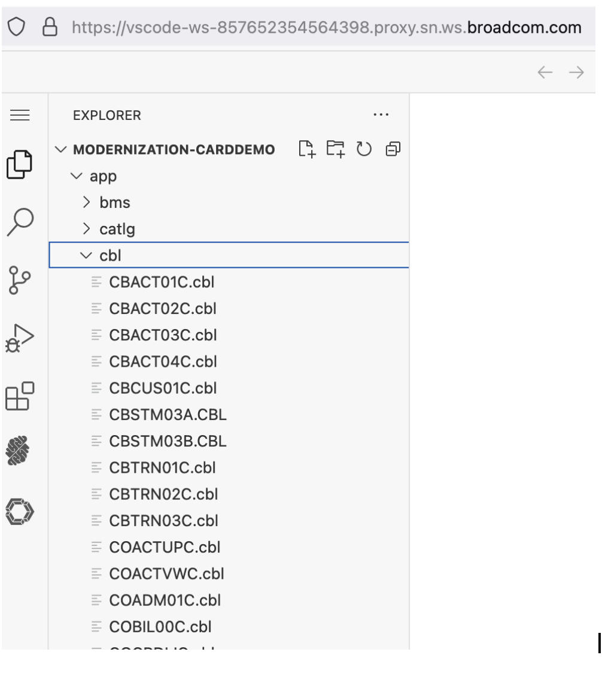
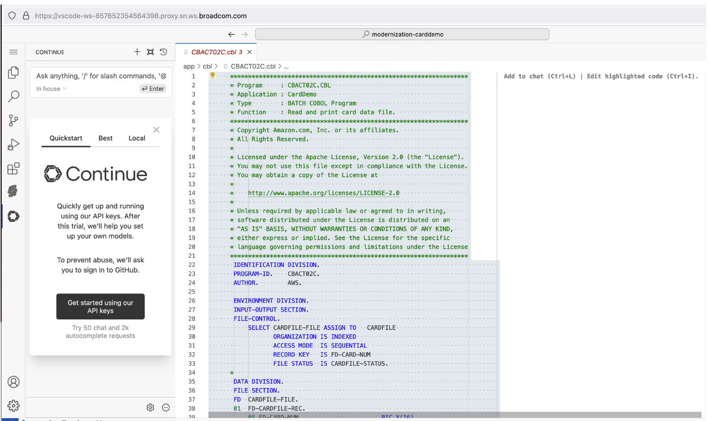
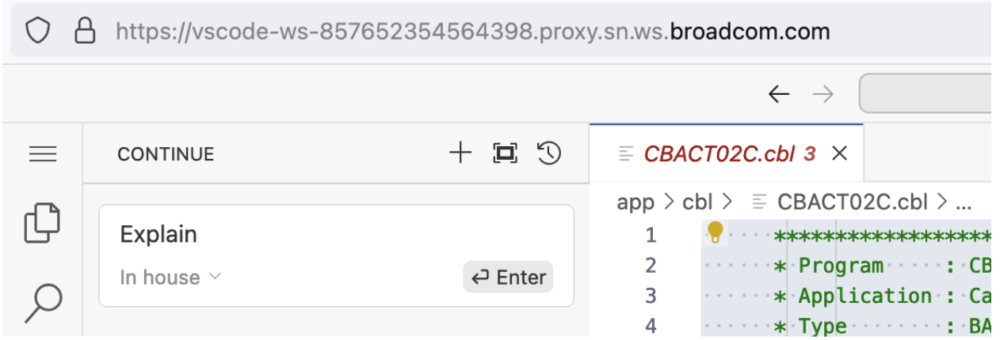
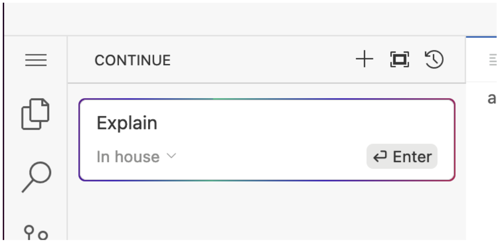
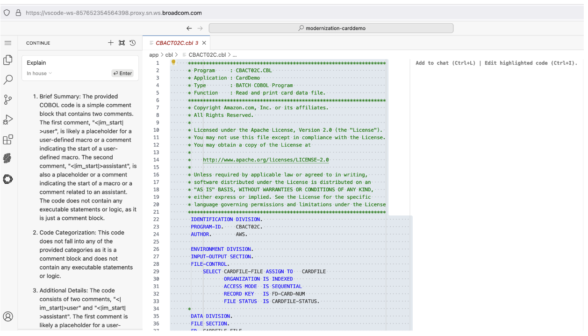
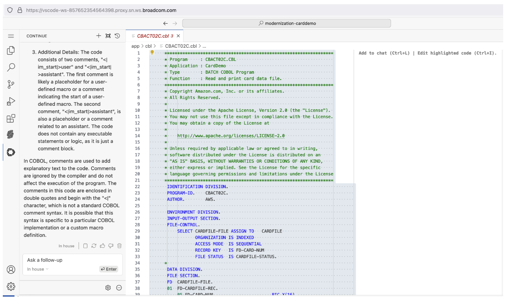

# Generative AI - Workshop Scenarios

## Scenario 1: Code Explain 

1. Open a cobol program in the Explorer tab.
MODERNIZATION-CARDDEMO -> app -> cbl -> Pick any of the .cbl programs from here. 

Reference Screenshot: 

Select the complete program or snippet the program and enter (Ctrl + L if you are on windows. Cmd + L if you are on Mac). 

Enter “Explain” and hit enter 

The out come appears like below: 

What we ask from you is to:

1). Validate the accuracy of explanation

2). Value or usefulness of the explanation. 

## Scenario 2: Test case suggestions

