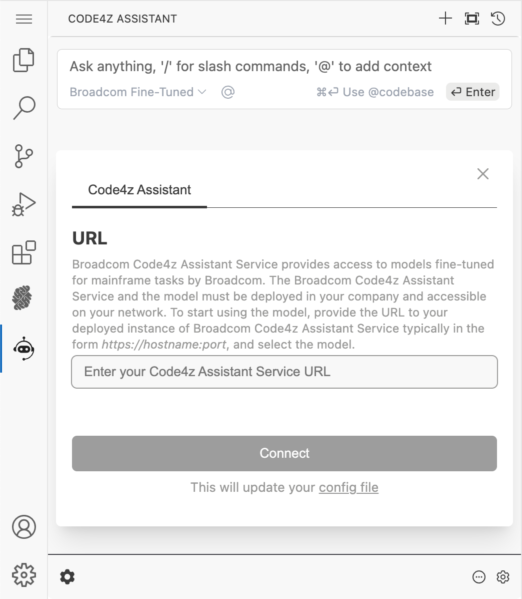
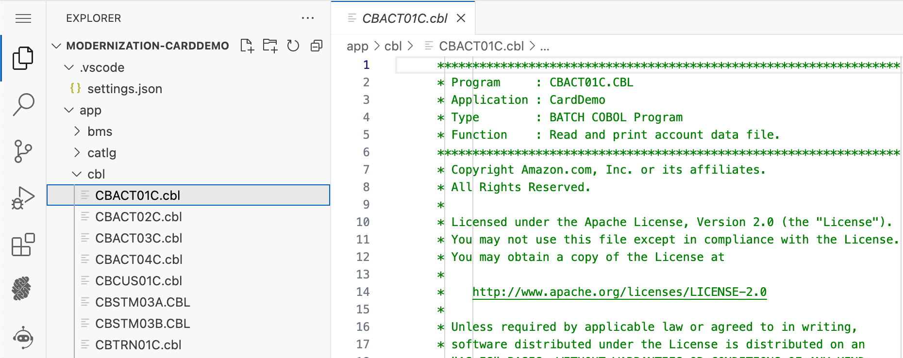
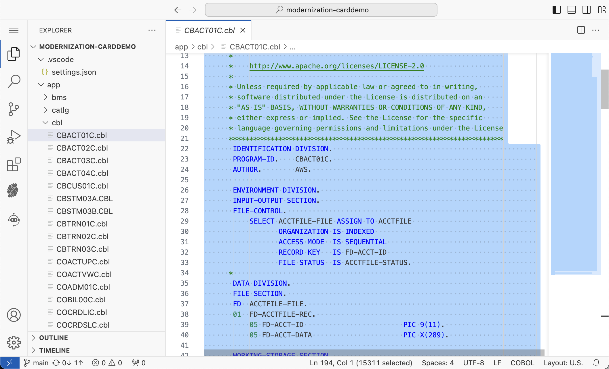
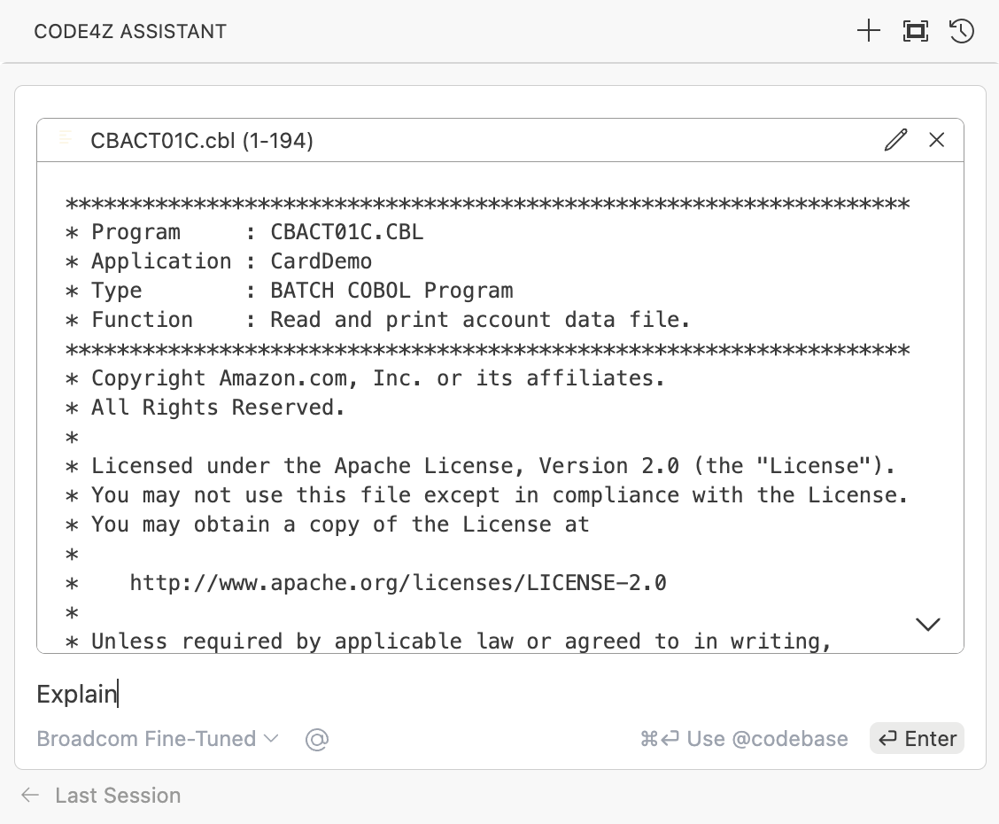
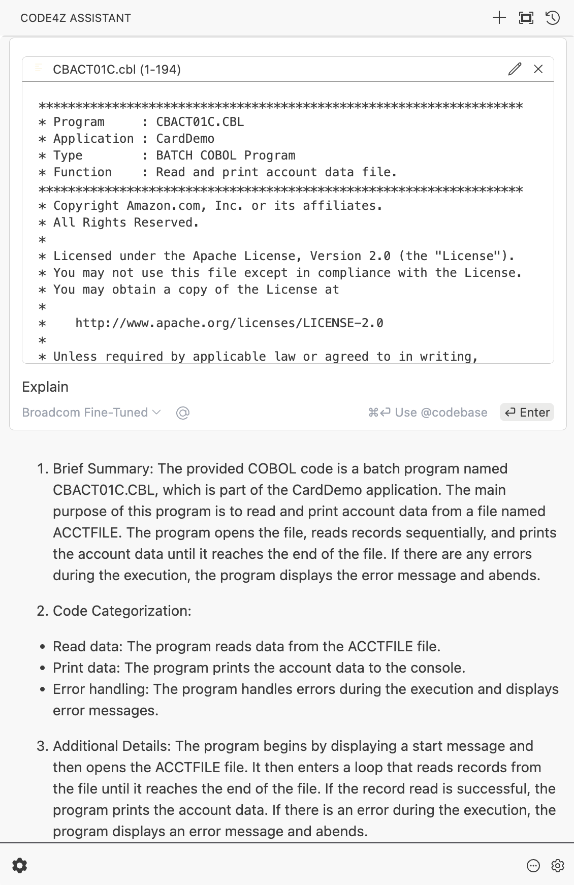
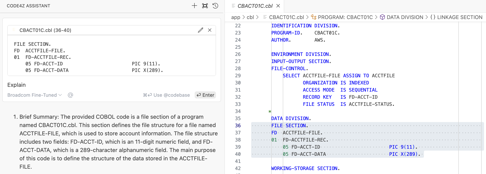

# Code4z Assistant - Workshop Scenarios

## Initial Setup

The Code4z Assistant VS Extension is used for this workshop. It is already installed and configured in your Code4z Assistant VS Extension.

To open the Code4z Assistant view, use its icon in the activity bar: 

This will open the following view:

The workshop environment is already configured to connect with the Code4z Assistant service. You can close the configuration by clicking the **X** button.

## Scenario 1: Code Explanation

The Code4z Assistant VS Extension provides a feature to explain COBOL code in a human-readable way. It uses natural language processing and machine learning techniques to generate explanations for the code.

You can explain sections of a program or entire programs.

Follow these steps:

1. Select a COBOL program from the Explorer view. For example, navigate to: `MODERNIZATION-CARDDEMO` / `app` / `CBACT01C.cbl`.

    

2. To select all code, first focus on the editor by clicking inside it, then press `⌘`+`A` on macOS or `Ctrl`+`A` on Windows.

    

3. The selected code will be displayed in a panel on the right side of the VS Code window. Type `Explain` and press Enter to start the explanation process.

    

4. The Code4z Assistant will provide an explanation of the selected code in natural language.

    

5. You can ask follow-up questions if needed. You can also select a specific part of the code and repeat the explanation process to focus on that part. The selected code can be added to the chat using  `⌘`+`L` on macOS or `Ctrl`+`L` on Windows.

    

Please share your feedback for the Scenario 1:

- Was the information provided accurate and useful?
- What parts of the code would you use the explanation on?

## Troubleshooting Tips

If you notice that progress has stalled in VS Code, try refreshing the window. Here’s how to do it:

1. Open the **Command Palette**:

   - Use the keyboard shortcut: `⌘`+`⇧`+`P` on macOS or`Ctrl`+`Shift`+`P` on Windows.
   - Alternatively, click the three vertical lines (hamburger menu) in the top left corner, go to **View**, and select **Command Palette**.

2.	In the Command Palette, type `Reload Window` and press Enter. This will reload the VS Code window.

