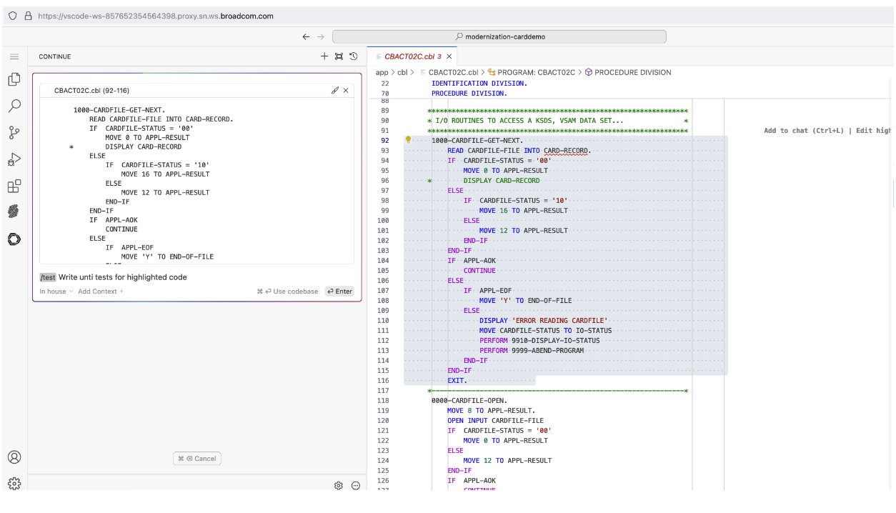
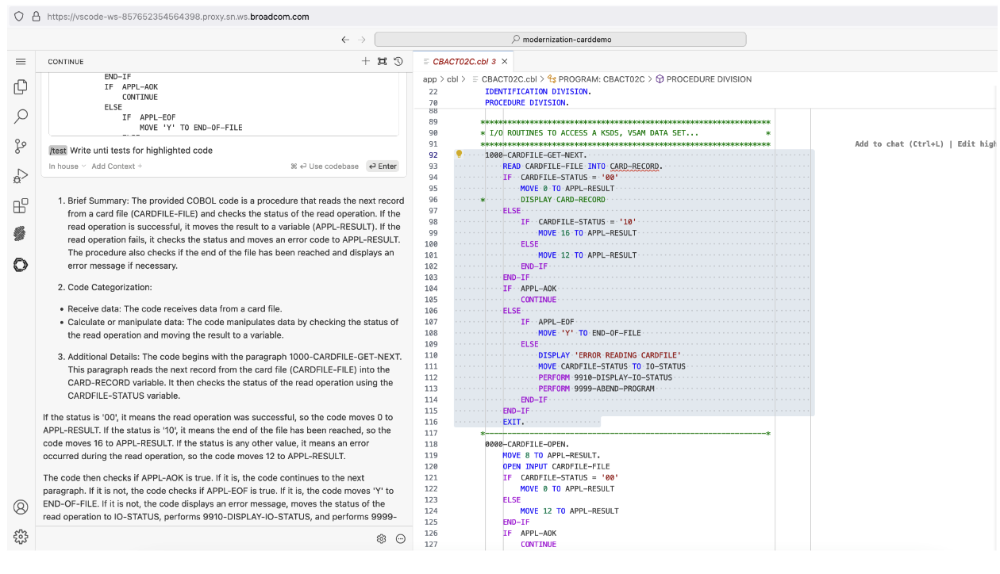
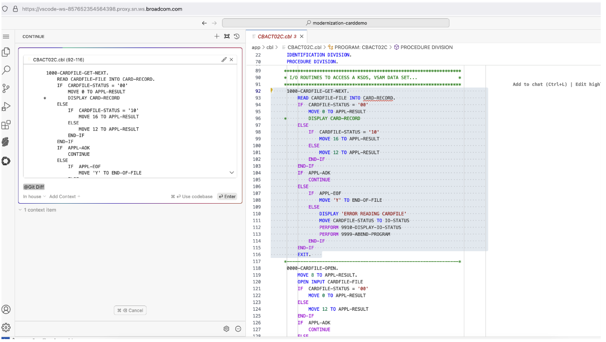
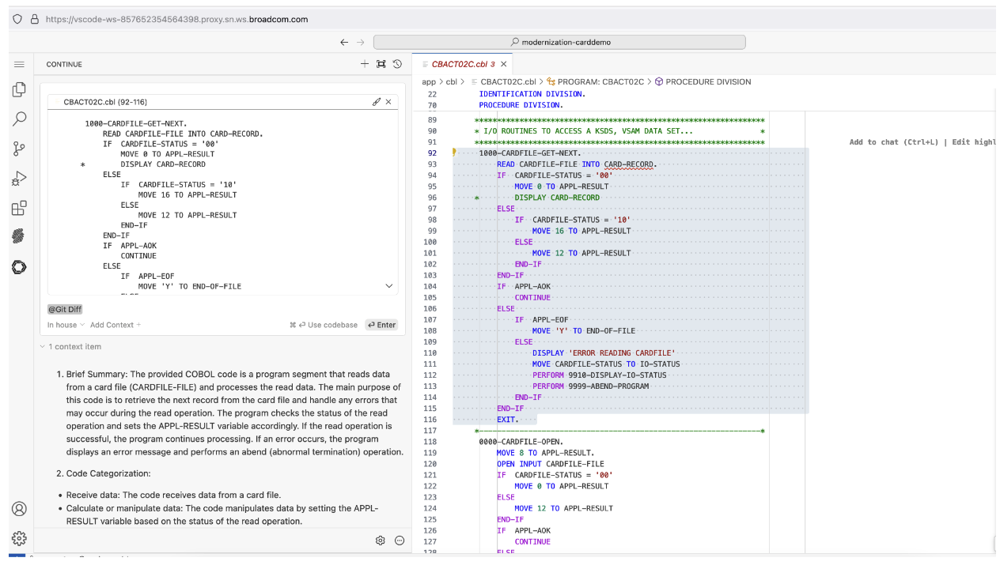
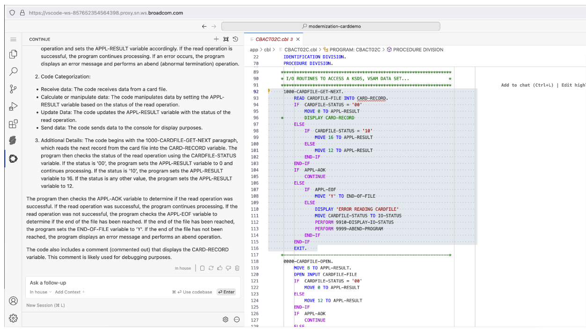

# Generative AI - Workshop Scenarios

## Scenario 1: Code Explain 

Pick one of the cobol program's from the Explorer tab.

MODERNIZATION-CARDDEMO -> app -> cbl -> Pick any of the .cbl programs from here.

Reference Screenshot:

Select the complete program or code snippet from the program. Select Ctrl + L if you are on windows or Cmd + L if you are on Mac - This will copy the code contents into the Generative AI extension. 

In the prompt, type "Explain" and hit enter. Reference screenshot:

The Generative AI ouput would be something inlines of reference screenshots listed below:  

Please share feedback notes for Scenario 1:

1). Validate the accuracy of explanation?

2). Value or usefulness of the explanation? 

## Scenario 2: Test case suggestions

Pick one of the cobol program's from the Explorer tab.

MODERNIZATION-CARDDEMO -> app -> cbl -> Pick any of the .cbl programs from here.

Reference Screenshot: 

Select the complete program or code snippet from the program. Select Ctrl + L if you are on windows or Cmd + L if you are on Mac - This will copy the code contents into the Generative AI extension. 

In the prompt, type "/test" and hit enter. Reference screenshot: 

The Generative AI ouput would be something inlines of reference screenshot listed below:  

Please share feedback notes for Scenario 2:

1). Is this something useful?

2). Are these something that you would look for while testing a cobol program?

## Scenario 3: Git diff

Pick one of the cobol program's from the Explorer tab.

MODERNIZATION-CARDDEMO -> app -> cbl -> Pick any of the .cbl programs from here.

Reference Screenshot: 

Select the complete program or code snippet from the program. Select Ctrl + L if you are on windows or Cmd + L if you are on Mac - This will copy the code contents into the Generative AI extension. 

In the prompt, type "/Git Diff" and hit enter. This will reference the current git diff. In addition to listing if the files being changed, this command output gives the context to the changes made. Reference screenshot: 

Command Run:

The Generative AI ouput would be something inlines of reference screenshots listed below:  

Please share feedback notes for Scenario 3.

## Troubleshooting Tip: 

Please refresh the VS Code window if at any point you see things are not making progress. 
Listing the details on refreshing the VS Code window:

1). Select the three vertical lines on the top left -> View -> Command Palette

Reference Screenshot: 

2). Once the Command Palette is open, Type in "Reload Window" and hit enter, this will reload the VS Code window. 

Reference Screenshot: 

